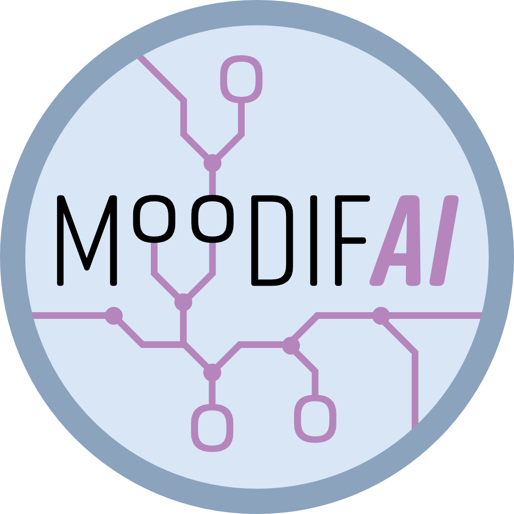

<h1 align="center">

<b> MoodifAI: Unveiling Psychophysiological States Through AI and Wearable Data  </b>
 
</h1> 

## Overview

This repository contains the codebase for **MoodifAI**, a framework designed to explore and analyze mood patterns using advanced AI techniques. The project focuses on preprocessing wearable patch data, generating time series features, and training deep learning models for psychophysiological state assessment.  

The work is associated with the paper:  
**"Longitudinal and Objective Psychophysiological State Assessment in Real-World Settings: A Data-Driven Analysis of Wearable Patch Data"**.  

## Repository Contents  

### 1. `preprocessing/`  
Scripts and utilities for cleaning and preparing raw wearable patch data  

### 2. `ML_experiments/`  
Deep learning experiments for psychophysiological state assessment:  
- **`ML_experiments/utils/ml_dataset_builder.py`**: Processes the time-series features generated during preprocessing, formats the data, and saves it as a dataset for use in experiments.
- **`run_classification.py`**: End-to-end script for training and evaluating deep learning models.  

### 3. `figures/`  
Scripts to reproduce the figures used in the paper: 

## 💓 Wearable ECG patch data - Vivalink - used in the paper
  [Vivalink](https://www.vivalink.com/) is a wearable ECG patch with the following features:
  -  **Single lead ECG sensors** (128 Hz)
  -  **Accelerometer sensor** (3 axis, 25 Hz - custom rate)
  - Derived  **Respiration Rate**
  - Derived  **Heart Rate**
